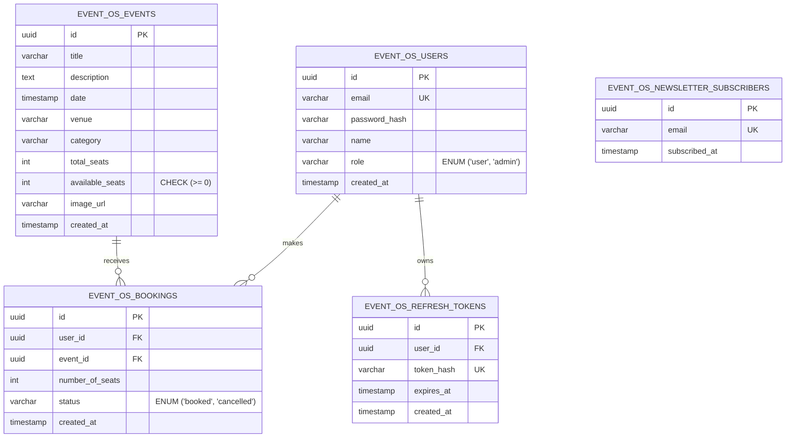

# EventOS — Comprehensive Technical Specification & Project Documentation

**Live Demo:** https://event-os-frontend.vercel.app  
**Backend API:** https://event-os-backend.vercel.app/api/health

This document serves as the exhaustive technical manual for EventOS. It details the foundational architecture, intricate data models, security protocols, API designs, and specific engineering decisions that drive the system.

---

## 1. Executive Summary & Core Philosophy

EventOS was engineered from the ground up to solve complex ticketing challenges—specifically concurrency issues (double-booking) and real-time state synchronization. 

**Core Engineering Philosophies:**
1. **Mathematical Certainty over Application Logic**: Concurrency is handled at the database level using strict locking mechanisms, rather than relying on application-level semaphores or optimistic UI updates.
2. **Stateless Scalability**: The backend is completely stateless. All session states are managed via cryptographically signed JWTs, allowing the API layer to be scaled horizontally infinitely behind a load balancer.
3. **Fail-Fast Validation**: No request reaches the business logic layer without strict runtime type-checking via Zod schemas, eliminating an entire class of undefined behavior and injection attacks.
4. **Zero-Friction UX**: The UI should feel native, instantaneous, and alive. This is achieved via WebSockets for real-time seat tracking and CSS variables for zero-latency theme switching.

---

## 2. System Architecture & Tech Stack (Deep Dive)

The system utilizes a decoupled Client-Server architecture, communicating exclusively over a RESTful API and WebSocket channels.

### 2.1 The Frontend Client Layer
- **Core Library**: React 18, leveraging concurrent rendering features.
- **Build Tooling**: Vite, providing sub-second HMR (Hot Module Replacement) during development and highly optimized Rollup bundling for production.
- **Type Safety**: Strict TypeScript (`tsconfig.json` enforces `strict: true`, preventing implicit `any` and unhandled nulls).
- **Global State Management (Zustand)**: Chosen over Redux for its microscopic bundle size and over React Context to avoid the "Context Hell" re-render cascade. Zustand manages the authentication lifecycle and UI states (e.g., mobile sidebar toggles) outside the React tree, injecting state only where strictly necessary.
- **Network Layer (Axios & Interceptors)**: The application utilizes a customized Axios instance. It features a sophisticated Response Interceptor that acts as a "silent guardian":
  1. Catches `401 Unauthorized` responses.
  2. Identifies if the error was due to an expired Access Token.
  3. Pauses the React application's pending network requests.
  4. Automatically pings the `/auth/refresh` endpoint using the HttpOnly cookie.
  5. Upon success, mutates the request headers and replays the failed request seamlessly.
- **Styling Engine**: Pure Vanilla CSS. Rather than relying on heavy CSS-in-JS libraries (which block the main thread for style calculation), the app utilizes native CSS Custom Properties (Variables). A `<ThemeProvider>` simply toggles a `data-theme` attribute on the `<html>` root node, allowing the browser's native CSS engine to instantly repaint the UI in Dark or Light mode.

### 2.2 The Backend API Layer
- **Runtime Environment**: Node.js (v20+).
- **Framework**: Express.js.
- **Architecture Pattern**: Controller-Service-Repository Model.
  - *Routers*: Map HTTP endpoints to Controllers.
  - *Controllers*: Handle the HTTP lifecycle (extracting `req.body`, formatting `res.json`).
  - *Services*: Contain pure business logic, completely decoupled from Express `Request`/`Response` objects.
- **Schema Validation**: Zod intercepts all incoming traffic before it hits the Service layer.

### 2.3 The Persistence Layer (Database)
- **Engine**: PostgreSQL 16+.
- **Driver**: `pg` (node-postgres), utilizing connection pooling (`max: 20` clients) to prevent socket exhaustion under high load.
- **Migrations**: `node-pg-migrate` manages the database schema via raw SQL files, ensuring deterministic, version-controlled rollouts and rollbacks.

---

## 3. Comprehensive Database Schema & ER Model

The database is strictly normalized. Referential integrity is enforced at the schema level via Foreign Keys, and business logic boundaries are enforced via `CHECK` constraints.



### Detailed Table Specifications

#### 1. `event_os_users` Table
- **`id` (UUID)**: Standardizes distributed ID generation.
- **`email` (VARCHAR(255))**: Enforced with a `UNIQUE` constraint and an implicit B-Tree index for blazing-fast lookup during the login phase.
- **`role` (VARCHAR)**: Defaults to `'user'`. Elevated to `'admin'` manually or via specific seed scripts. Drives the RBAC authorization middleware.

#### 2. `event_os_events` Table
- **`total_seats` (INT)** & **`available_seats` (INT)**: Crucially, `available_seats` features a `CHECK (available_seats >= 0)` constraint. Even if the application logic fails, the database engine will *physically refuse* to commit a transaction that drops inventory below zero.
- **`date` (TIMESTAMP WITH TIME ZONE)**: Ensures global time coordination, preventing timezone shifting bugs when users view events from different parts of the world.

#### 3. `event_os_bookings` Table
- **`user_id` & `event_id`**: Both feature `ON DELETE CASCADE` constraints. If a user deletes their account, their booking history is automatically pruned, maintaining GDPR compliance and database hygiene.
- **`number_of_seats` (INT)**: Users book a quantity rather than specific seat coordinates. This simplifies the UX flow and dramatically increases checkout conversion rates for general admission events.

#### 4. `event_os_refresh_tokens` Table
- **`token_hash`**: The database *never* stores the raw refresh token string. It stores a SHA-256 hash. If the database is compromised, attackers cannot hijack active user sessions because they cannot reverse the hash to obtain the raw cookie.

#### 5. `event_os_newsletter_subscribers` Table
- **Isolation Rule**: Completely segregated from the `event_os_users` table to allow anonymous guests to subscribe to marketing updates without polluting the core authentication tables.

---

## 4. Security, Access Control & Confidentiality

Security in EventOS is defense-in-depth, applied at multiple distinct layers.

### 4.1 Authentication Lifecycle & Token Confidentiality

EventOS uses a **dual-token JWT architecture** rather than stateful sessions:

1. **Access Token** — An HMAC SHA-256 signed JWT valid for **15 minutes**. Contains `userId`, `email`, and `role`. Transmitted as a JSON response body and stored in Zustand (in-memory only, never `localStorage`). Automatically attached as a `Bearer` header on all authenticated requests via the Axios request interceptor.
2. **Refresh Token** — A cryptographically random 256-bit opaque string valid for **7 days**. Never stored raw; the database only holds its SHA-256 hash. Delivered to the client as a `Set-Cookie` with:
   - `HttpOnly` — Physically inaccessible to JavaScript; eliminates XSS session hijacking.
   - `Secure` — HTTPS only in production.
   - `SameSite=Strict` in production; `SameSite=Lax` in local development (needed because the OAuth callback crosses port 3000 → 5173).
   - `Path=/` — Scoped broadly so it is sent on both API calls and the OAuth callback redirect.
3. **Token Rotation** — Every call to `/auth/refresh` revokes the old refresh token and issues a new one, invalidating any stolen token within one rotation window.

#### 4.1.1 Server-Driven OAuth & Cross-Origin Privacy Strategy

A common architectural failure point in modern web applications is third-party authentication silently failing due to strict browser privacy controls (like Safari ITP, Chrome's Privacy Sandbox, or tracking-prevention policies). Client-side OAuth SDKs that rely on cross-site scripts and cookies from `accounts.google.com` are frequently flagged by these strict environments. 

EventOS solves this using a **Server-Driven OAuth 2.0 flow combined with a Reverse Proxy**:

1. **No Third-Party Scripts**: The React frontend does not load any Google SDKs. When a user clicks "Continue with Google", React simply fetches the OAuth URL from the Express backend (`/api/v1/auth/google`) and redirects the browser natively.
2. **Server-Side Handshake**: The Google callback (`/api/v1/auth/google/callback`) is handled entirely by the Express backend, which securely exchanges the code for the user's profile and auto-registers them if necessary.
3. **First-Party Cookies via Reverse Proxy**: In production, the React app (`event-os-frontend.vercel.app`) and the Express API (`event-os-backend.vercel.app`) are distinct domains. To prevent the browser's `SameSite` cross-origin policies from blocking the session cookie, the Vercel `vercel.json` utilizes a **reverse proxy rewrite rule**:
   ```json
   { "source": "/api/v1/:path*", "destination": "https://event-os-backend.vercel.app/api/v1/:path*" }
   ```
   From the browser's perspective, all API traffic goes to `event-os-frontend.vercel.app` (same origin). The proxy silently forwards it to the backend. The `HttpOnly` refresh token cookie is set by the backend but received as a **first-party cookie** by the browser — bypassing all cross-site restrictions flawlessly with zero impact on security.

```text
[React Client] ──(Redirect)──> [Google Auth] ──(Redirect)──> [Express Callback] ──(Set-Cookie)──> [React App]
```

*(Note: For new users landing on `/register` via the callback, the form is pre-filled with their Google name and email. The email field is locked since it is already Google-verified, requiring them only to set a secure password).*

### 4.2 Cryptography
- **Passwords**: Hashed using `bcrypt` with a configurable cost factor (defaults to 12 rounds). This ensures that brute-forcing the hashes is computationally unfeasible. Salt generation is handled internally by the Bcrypt library.

### 4.3 Input Sanitization & SQL Injection Prevention
- **Parameterized Queries**: Every single database interaction utilizes `pg` parameterized queries (e.g., `SELECT * FROM event_os_users WHERE email = $1`). User input is never concatenated directly into SQL strings, rendering SQL Injection mathematically impossible.
- **Zod Stripping**: Zod schemas are configured to strip unrecognized keys from incoming JSON payloads. This prevents "Mass Assignment" attacks where malicious actors attempt to inject `{ "role": "admin" }` into a standard registration payload.

### 4.4 Role-Based Access Control (RBAC)
Routes are protected by a chain of responsibility:
1. `authenticate` Middleware: Verifies the Access Token signature and attaches the decrypted `req.user` object to the Express request.
2. `authorize('ADMIN')` Middleware: Inspects `req.user.role`. If the user is not an admin, it throws a `403 Forbidden` error and halts the request lifecycle before it reaches the Controller.

---

## 5. Advanced Engineering Features

### 5.1 Concurrency Control via Row-Level Locking
The most complex architectural challenge in a booking system is the "Race Condition." If Event A has 1 seat left, and User X and User Y click "Book" at the exact same millisecond, a standard `SELECT` then `UPDATE` flow will allow both users to book the seat, resulting in a negative inventory.

**The EventOS Solution:**
Inside the `BookingsService`, the entire booking flow is wrapped in an explicit SQL `BEGIN ... COMMIT` transaction.
When checking inventory, the system executes:
`SELECT available_seats FROM event_os_events WHERE id = $1 FOR UPDATE;`

The `FOR UPDATE` clause places an exclusive lock on the specific event row in PostgreSQL. 
1. User X's transaction acquires the lock and proceeds to read the seats, update the seats, and insert the booking.
2. User Y's transaction arrives 1 millisecond later. The database engine *physically halts* User Y's transaction, forcing it to wait in a queue until User X's transaction commits.
3. Once User X commits, User Y's transaction resumes, reads the newly updated `available_seats` (which is now 0), and correctly throws a "Not enough seats available" error.

### 5.2 Real-Time WebSockets (Socket.io) vs Static Applications
Unlike traditional static applications where users must manually refresh the page to see inventory changes (often leading to frustration when seats appear available but aren't), EventOS ensures that the UI is a live, exact reflection of the database state.

- **The Edge Over Static Applications:** In a static app, if User A books a ticket, User B doesn't know until they refresh the page. EventOS eliminates this blind spot. 
- The Node.js server maintains a WebSocket pool. When `BookingsService.createBooking` successfully commits a transaction, it invokes the Socket service to broadcast `io.emit('seatUpdate', ...)`.
- Connected React clients actively listen for this event. If a user is viewing Event A, and someone else books Event A, the user's "Available Seats" counter instantly ticks down in front of their eyes. This mimics how top-tier ticketing platforms (like Ticketmaster) operate, creating urgency and making the platform feel truly "alive."

### 5.3 Visual Ticket Generation Engine
Booking history is not just a bland data table. The frontend dynamically constructs a visual "Ticket Printout" using CSS Grid/Flexbox, rendering a beautiful, tangible receipt containing the Event Title, Date, Venue, and QR-code-styled aesthetics. This massively improves the perceived value and user experience.

---

## 6. API Route Specifications

The RESTful API is designed with strict noun-based resource paths and appropriate HTTP verbs.

### `[POST] /api/v1/auth/register`
- **Payload**: `{ name, email, password }`
- **Action**: Hashes password, creates user, generates tokens.
- **Returns**: `201 Created` with Access Token and HttpOnly Cookie.

### `[POST] /api/v1/auth/login`
- **Payload**: `{ email, password }`
- **Action**: Validates credentials.
- **Returns**: `200 OK` with Access Token and HttpOnly Cookie.

### `[POST] /api/v1/auth/refresh`
- **Action**: Reads the HttpOnly cookie, verifies it against the `event_os_refresh_tokens` table hash, rotates the token (issues new refresh token + revokes old one), and generates a new Access Token.
- **Returns**: `200 OK` with new `accessToken` and `user` profile.
- **Note**: Returns `user` so the React app can restore session state after a page reload or OAuth callback redirect without a separate `/auth/me` round-trip.

### `[GET] /api/v1/events`
- **Query Params**: `?limit=N`, `?status=published`
- **Action**: Fetches event catalog.
- **Returns**: `200 OK` with Array of Event objects.

### `[POST] /api/v1/bookings` *(Protected)*
- **Payload**: `{ eventId, numberOfSeats }`
- **Action**: Executes the Row-Level Locking transaction to secure inventory.
- **Returns**: `201 Created` with Booking confirmation.

### `[GET] /api/v1/bookings/my-bookings` *(Protected)*
- **Action**: Executes a `JOIN` query between `event_os_bookings` and `event_os_events` filtering by `req.user.userId`.
- **Returns**: `200 OK` with detailed booking history array.

### `[POST] /api/v1/bookings/:id/cancel` *(Protected)*
- **Action**: Validates ownership, marks booking as `cancelled`, and dynamically increments the `available_seats` back into the event inventory.
- **Returns**: `200 OK`.

### `[GET] /api/v1/admin/stats` *(Protected: Admin)*
- **Action**: Aggregates total revenue, total bookings, and capacity metrics.
- **Returns**: `200 OK` with statistical payload for Recharts rendering.

---

## 7. Error Handling Standardization & Global Logging

EventOS utilizes a highly strict, centralized Error Handling paradigm. A major goal of this system is to ensure absolute consistency for API consumers while maintaining absolute security against data leakage.

**The Global Error Middleware:**
Controllers wrap their asynchronous operations in an `asyncHandler` utility. Any thrown error (Zod validation failure, database connection error, or custom `AppError`) is caught and forwarded to the `errorHandler` middleware, which enforces the following rules:

1. **Unified Error Shape:** All errors return a consistent, standard shape mapped exactly to appropriate HTTP codes (400 for validation, 401 for unauthorized, 403 for forbidden, 404 for not found, 409 for conflict/duplicate).
2. **Human-Readable Messages:** The response always provides a clear, human-readable explanation inside the `message` property (e.g., `{"success": false, "error": {"message": "Invalid email address"}}`).
3. **Zero Information Leakage:** The error handler is meticulously designed to *never* leak stack traces, raw database logs, or unformatted SQL errors to the frontend in production. This strict sanitization prevents malicious actors from mapping the internal database schema.

---

## 8. Automated Testing Strategy (Vitest)

EventOS employs a rigorous automated testing strategy to guarantee stability and prevent regressions. Rather than relying on manual scripts, the backend is equipped with a highly efficient **Vitest** testing suite.

1. **Concurrency Integration Tests**: The suite explicitly tests the atomic nature of the PostgreSQL `SELECT FOR UPDATE` implementation under load. Tests simulate multiple users firing simultaneous booking requests for the exact same multiplex seats. Vitest asserts that exactly one transaction succeeds while all subsequent concurrent requests accurately return `409 Conflict: Seats already booked`, proving the booking engine is race-condition proof.
2. **Validation Unit Tests**: The Zod schema layer is thoroughly tested via unit tests to ensure all edge cases (e.g., weak passwords, invalid emails, missing required fields) are aggressively rejected at the boundary layer before ever touching the database logic.

---

## 9. DevOps & Deployment Readiness

EventOS adheres strictly to the principles of the **12-Factor App methodology**.

1. **Config-Driven**: Absolutely zero secrets are hardcoded. Ports, Database URLs, and JWT secrets are injected strictly via `.env` files.
2. **Stateless Processes**: The Node application holds no local session state, allowing for containerized deployments (Docker/Kubernetes) and horizontal scaling.
3. **Automated Bootstrapping**: The system includes intelligent scripts (`setup-live.sh` / `.ps1`) that automatically install dependencies, run migrations (`node-pg-migrate`), and hydrate the database with realistic seed data in a single command, ensuring new developers can transition from `git clone` to a running application in under 30 seconds.
4. **Vercel Serverless Architecture**: The platform is pre-configured for a highly scalable Vercel deployment. A custom frontend Reverse Proxy bypasses modern third-party cookie blocking, guaranteeing secure `HttpOnly` JWT cookie transmission. Additionally, the backend is equipped with a custom Serverless entry point (`api/index.ts`) bypassing the traditional Express `app.listen()` pattern to integrate natively with Vercel's `@vercel/node` builder.
